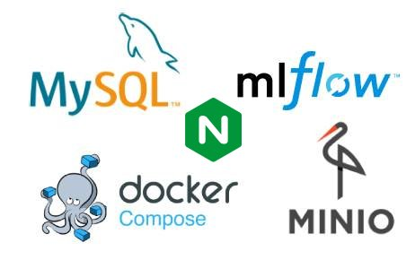

# MLflow instance setup



This repository contains the necessary files to comfortably setup a multi-container service running an MLflow server for experiment tracking. The built services are a **MySQL** database for storing metrics, a **MinIO** instance for object storage of experiment artifacts, and the obligatory **MLflow** server.
The MLflow server sits behind an **NGINX** reverse proxy for password protection, as MLFlow does not allow password protection
out of the box.

## Walkthrough

If you have a new project where experiments should be tracked with MLflow, perform the following steps:

1. Copy the contents of this repository (you can clone it, but it is not necessary) into a folder on the host on which the mlflow server should be running. 

   **Note**: It is recommended that you use a fresh folder named like your project with sufficient space on the host machine. Note that within this folder two directories will be automatically created later containing the MinIO storage and the MySQL database. 

2. **Info**: Everything important resides in the `docker` directory. There is a `docker-compose.yml` file which gets its project specific variables from a `.env` file. The `docker-compose` sets up a MySQL container, a MinIO object storage, an intermediate container which creates the MinIO bucket, and the MLflow server. The directory `docker/mlflow_server` contains the Dockerfile for the mlflow server, which does nothing more than set up a container with Python and installs MLflow and its dependencies. 

3. All you need to do is to edit the file `docker/.env`  and set the variables appropriately. The different variables are as follows:

   - **COMPOSE_PROJECT_NAME** : Sets a custom name for your project, for more info see [here](https://docs.docker.com/compose/reference/envvars/#compose_project_name).
   - **PROJECT**: Choose a custom name for your project. Can be the same as COMPOSE_PROJECT_NAME. Note that the containers' names are not derived from COMPOSE_PROJECT_NAME, but are appended to the service name, e.g. `s3_${PROJECT}`.
   - **S3_PORT**: Port on which the MinIO service is reachable on the host. (internally, Docker maps MinIO port 9000 to the given port on the host). On this port, also the MinIO GUI is reachable.
   - **PORT**: Port on which to reach the MLflow server via nginx. This is the port over which the server is reachable from outside and which gets proxied by nginx. Use a port that is not already occupied on host.
   - **MLFLOW_USER**: Username to authenticate with for Mlflow GUI and tracking.
   - **MLFLOW_PASSWORD**: Password to authenticate with for Mlflow GUI and tracking.
   - **MYSQL_DATABASE**: Choose custom MySQL Database name
   - **MYSQL_USER**: Choose custom MySQL user name. Default `user`.
   - **MYSQL_PASSWORD**: Choose custom MySQL user password. Default `passwd`.
   - **MYSQL_ROOT_USER**: Choose custom MySQL root user name: Default `rootuser`.
   - **MYSQL_ROOT_PASSWORD**: Choose custom MySQL root user password: Default `passwd`.
   - **AWS_ACCESS_KEY_ID**: Choose custom access key id for MinIO. Default `minio_id`.
   - **AWS_SECRET_ACCESS_KEY**: Choose custom secret access key for MinIO. Default `minio_key`.
   - **PROXY_SERVER**: When building the MLflow image, a `pip install` call is needed. Set here the proxy address for this call. **Note**: If you do not need to pass a proxy to `pip install`, remove the `--proxy $PROXY_SERVER` on line 4 of `docker/mlflow_server/Dockerfile`.
   
   **Important Note**: Make sure that the ports specified for DB_PORT, S3_PORT and MLFLOW_PORT are not yet occupied by something else on the host machine. 
   
4. Once the `.env`-file has been configured, under the directory `docker`, run `docker-compose up -d` to spin up all services and detach so it is running in the background. (if an error occurs, for debugging purposes, simply run `docker-compose up`). Note that MinIO will create a directory called `minio` for the object storage on the same level as the `docker`-folder, and MySQL will create on the same level a directory called `mlflow_sql_db`. All data will be persistent as long as these folders exist, even if the containers are down. Delete these folders for a complete wipe.

5. To reach the MLflow web app, forward the port from the host machine to your own via SSH as known, in the following way:

   ```
   $ ssh -L <Local Port>:localhost:<PORT> <user>@<host>
   ```

   Or you simply navigate to it via the IP address of the host under `http://<IP address of host>:<PORT>`
   MLflow is then reachable with your browser locally under `http://localhost:<Local Port>`, where `<Local Port>` is a local port of your choice. 


### Logging to MLflow

An example of how to log to MLflow can be found in the `example` folder. To test your setup on the host machine, set the corresponding config in `example/log_example.py` to your settings and  run `python log_example.py` on the host, which should log a hyperparameter, a metric and an image to the artifact store. Note that when logging remotely to MLflow from a different workstation, make sure to set `os.environ["MLFLOW_S3_ENDPOINT_URL"]` to the IP-address of the host with `S3_PORT` in the .env-file, and the `remote_server_uri` to the IP-address of the host with `MLFLOW_PORT` in the .env-file.

